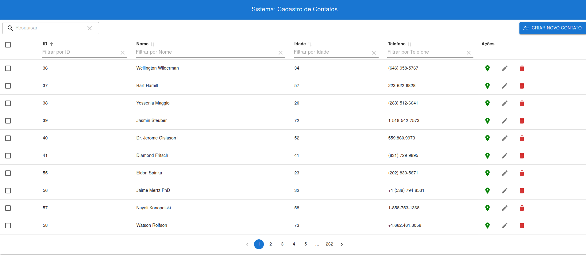
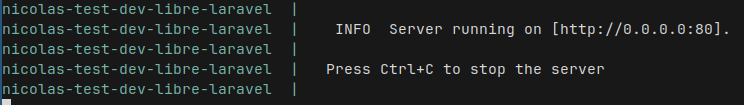
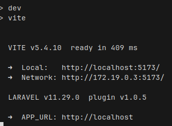

# Libre Soluções de Governo
## Processo Seletivo - Desenvolvimento

### Instruções Gerais

1. **Fork do Repositório:** Faça um fork **PÚBLICO** deste repositório.
2. **Tecnologias a serem utilizadas:**
   - **Backend:** Laravel 11
   - **Banco de Dados:** PostgreSQL
   - **Ambiente:** Livre (preferencialmente uso do Docker, mas não é obrigatório)
   - **Frontend:** Utilize um framework de sua preferência ou, se preferir, HTML5, JavaScript e CSS.

### Projeto: Cadastro de Contatos

#### Requisitos do Projeto

- **Página Principal:**
  - Exibir uma lista de contatos com os seguintes campos:
    - Sequencial
    - Nome
    - Telefone
    - Idade
  - Incluir uma barra de pesquisa para filtrar a lista de contatos.
  - Implementar paginação para a listagem.
  - Incluir um botão para cadastrar novos contatos.
  - Ao lado de cada contato, fornecer três botões de ação:
    - **Exibir Endereço:** Ao clicar, abrir um modal com o endereço do contato.
    - **Editar:** Permitir editar as informações do contato.
    - **Deletar:** Remover o contato da lista.

- **Tela de Cadastro:**
  - Permitir o cadastro de um novo contato, incluindo os campos de:
    - Nome
    - Telefone
    - Idade
    - Endereço (cep, rua, número, complemento, cidade, estado)

### Estilo e Design

- O estilo do site (cores, fontes e disposição dos elementos) é livre. Sinta-se à vontade para usar sua criatividade e refletir sua visão de design.

### Entrega

- Tempo de execução: 5 dias corridos (o tempo será contabilizado a partir da criação do Fork).

## SOLUÇÃO (Entregue em: 25/10/2024)

[Video de Apresentação da Solução](https://youtu.be/GVagGsuyJ-U)
[](https://youtu.be/GVagGsuyJ-U)


1. Requisitos Não-Funcionais Atendidos:
    - **Fork PÚBLICO do Repositório:** ✅
    - **Docker (ambiente)** ✅
    - **Laravel 11 (Backend)** ✅
    - **Framework qualquer [React] (Frontend)** ✅

2. Requisitos Funcionais Atendidos:
    - **Barra de Pesquisa que faça filtragem.** ✅
    - **Listar os contatos exibindo: SEQUENCIAL (ID), NOME, TELEFONE E IDADE.** ✅
    - **Ao lado de cada contato, fornecer três botões de ação:** ✅
      - **Exibir Endereço**: Ao clicar, abrir um modal com o endereço do contato. ✅
      - **Editar**: Permitir editar as informações do contato. ✅
      - **Deletar**: Remover o contato da lista. ✅
    - **Implementar paginação para a listagem.** ✅
    - **Botão para cadastrar novos contatos.** ✅

### Passos para replicar o resultado

O Docker é pré-requisito. Serão utilizados 3 scripts presentes no repositório:

1. `build_container.sh` - Criar a imagem do container.
2. `start_container.sh` - Iniciar o container.
3. `dependencies.sh` - Instalar dependências adicionais no container.


Certifique-se de que os scripts possuem permissão de execução:

**Linux**
```bash
chmod +x build_container.sh start_container.sh dependencies.sh
```

**Windows**
```powershell
Set-ExecutionPolicy RemoteSigned -Scope CurrentUser
```

⚠️ **Cuidado:** 

Antes de prosseguir, certifique-se que as seguintes portas não estão sendo utilizadas:

- **localhost:8000**
- **localhost:5173**
- **localhost:5432**

Se caso estejam sendo utilizadas, considere alterar tais portas no arquivo `docker-compose.yml` para valores que estejam disponíveis.

**Então**
```bash
./build_container.sh
```

No meu computador ele demorou <= 400s para rodar o comando `build_container.sh`

```bash
./start_container.sh
```



Após a imagem acima aparecer no terminal, abra um novo terminal **MANTENDO** esse último aberto e rodando o servidor.

```bash
./dependencies.sh
```


Após a imagem acima aparecer no terminal:

🥳 

Acesse no navegador -> `localhost:8000`